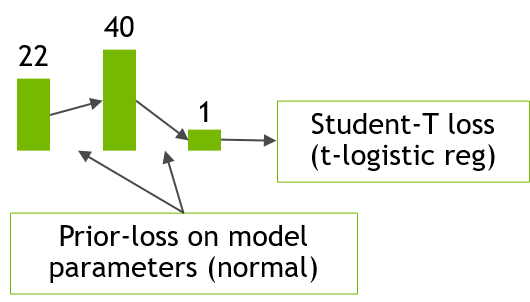

## Bayesian neural network (BNN) training using MCMC

This repository is a CUDA implementation of training a Bayesian neural network
using MCMC, specifically Hamiltonian Monte Carlo (HMC).

The following image shows the architecture of the neural network used here.

It is a small MLP with two layers, 22 features in the input, 40 hidden features
and a single output feature.  
The dataset size is 58368, used in its entirety
as the batch for estimating gradients.

## Performance measurements

The following table shows measurements of performance obtained using this
implementation.  
The numbers are multiplied by a factor of 200, imitating 200 windows on
which the training would be applied.

| Setting      | #Samples    | Time (min)  |
| -----------  | ----------- | ----------- |
| 1xA100, TF32 | 800         | 42          |
| 4xA100, TF32 | 800         | 14          |
| 1xA100, TF32 | 1600        | 84          |
| 4xA100, TF32 | 1600        | 23          |

## How to get started with this repo

### Initial setup

1. Clone and `cd path/to/repo`
1. `wget "https://s3-us-west-1.amazonaws.com/gc-demo-resources/returns_and_features_for_mcmc.tar.gz"`
1. `tar xf returns_and_features_for_mcmc.tar.gz`
1. `rm ._returns_and_features_for_mcmc.txt returns_and_features_for_mcmc.tar.gz`

### Compile/run

1. Requires:
   1. G++
   1. CTK
   1. CUDA run-time
1. Use `python compile_run.py --arch sm_70` for V100 (FP32 only)
1. Use `python compile_run.py --arch sm_80` for A100 (FP32 only)
1. Use `python compile_run.py --arch sm_80 --tc` for A100 (using TF32 through tensor cores)
